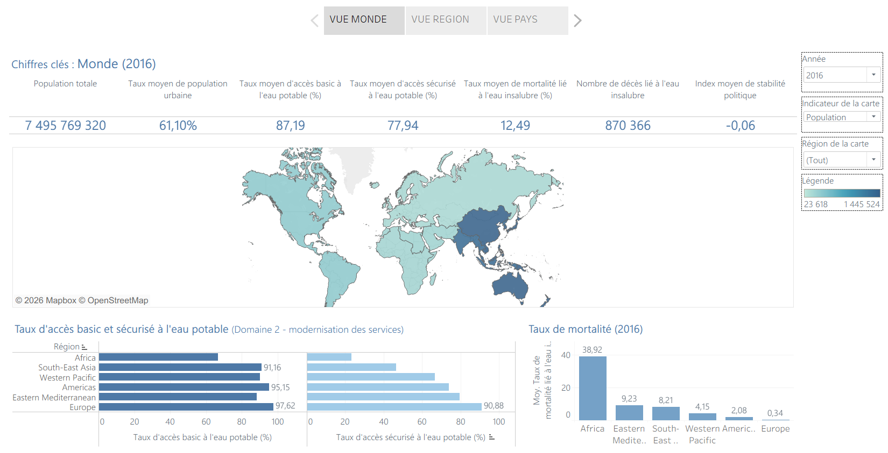
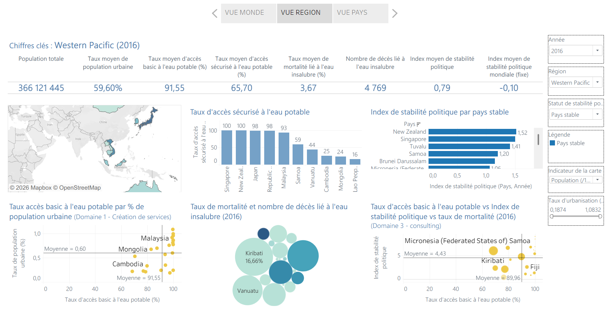
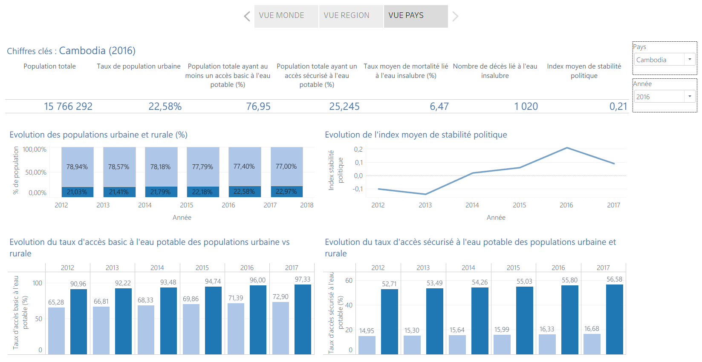

# Projet 10 – Faites une étude sur l'eau potable

## Contexte du projet

Ce projet porte sur la création d’un **tableau de bord interactif** pour l’ONG **DWFA (Drinking Water For All)**, dont l’ambition est de garantir l’accès à l’eau potable à chaque individu sur Terre.

Le tableau de bord a pour objectif :
- d’identifier les pays rencontrant des difficultés d’accès à l’eau potable,
- de prioriser les zones géographiques sur lesquelles concentrer les efforts de l’ONG.

Les domaines d’expertise de DWFA sont :
- la création de services d’accès à l’eau potable,
- la modernisation de services existants,
- le consulting auprès d’administrations et de gouvernements sur les politiques d’accès à l’eau.

---

## Objectifs pédagogiques

- Proposer un récit des résultats dynamique afin d’engager un public
- Optimiser une solution de visualisation accessible, adaptée au public et au type de données
- Créer un tableau de bord interactif pour rendre la visualisation disponible et compréhensible

---

## Outils utilisés

- **Tableau Public**
- **Python**

---

## Résultats du projet

Le tableau de bord se présente sous la forme d’une **histoire interactive en trois vues** :
- **Monde**
- **Région**
- **Pays**

Les indicateurs analysés sont :
- Population
- Taux d’urbanisation
- Taux d’accès basic à l’eau potable
- Taux d’accès sécurisé à l’eau potable
- Taux de mortalité (2016)
- Nombre de décès liés à l’eau insalubre
- Index de stabilité politique

Ces indicateurs sont présents dans chacune des vues, avec des **niveaux de granularité et des visualisations adaptés**.  
Chaque vue est construite de manière similaire avec :
- des chiffres clés,
- des graphiques pertinents,
- des filtres interactifs.

### Exemple de cheminement décisionnel

L’analyse débute par la **vue Monde**, qui met en évidence que les continents africain, sud-est asiatique et Pacifique ouest présentent les taux les plus faibles d’accès sécurisé à l’eau potable.

La **vue Région** révèle ensuite que les continents africain et sud-est asiatique comptent peu de pays avec un index de stabilité politique supérieur à la moyenne. Le choix stratégique se porte alors sur la région **Pacifique ouest**.

En comparant le nombre de décès liés à l’eau insalubre, le **Cambodge** se distingue avec plus de 1 000 décès recensés en 2016.

La **vue Pays** confirme ce diagnostic :
- 3 Cambodgiens sur 4 vivent en zone rurale,
- les faibles taux d’accès sécurisé à l’eau, en ville comme à la campagne, expliquent le nombre élevé de décès.

Pour aller plus loin, le Cambodge présente plusieurs atouts pour des interventions ciblées :
- une superficie trois fois plus petite que la France,
- la présence d’infrastructures clés (routes, aéroports internationaux),
- deux grands fleuves structurants.

Les actions recommandées incluent :
- le développement d’infrastructures d’accès à l’eau,
- des campagnes de sensibilisation à l’entretien des réseaux,
- des formations à la gestion des eaux usées.

---

## Compétences acquises

- Création d’un **blueprint** pour documenter les indicateurs utilisés
- Gestion des valeurs manquantes et amélioration de la qualité des données avec **Python**
- Utilisation de **Tableau Public** pour la création de visualisations
- Création de champs calculés, paramètres, filtres et hiérarchies
- Mise en œuvre d’une démarche de **storytelling data**

---

## Illustrations

### Vue Monde

### Vue Région

### Vue Pays

